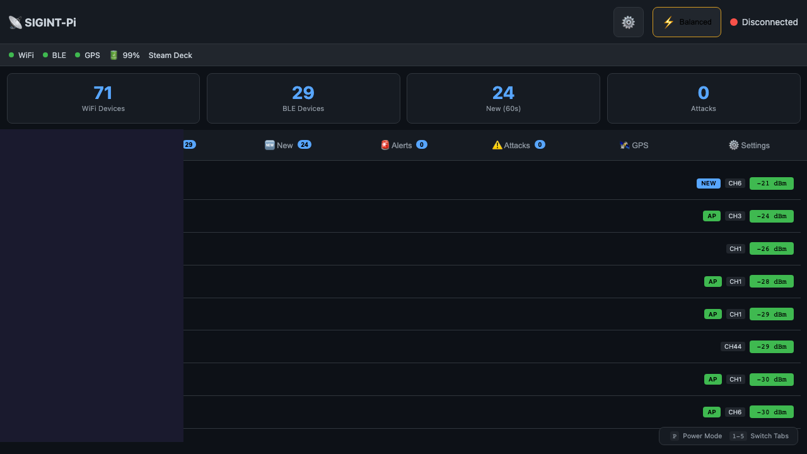
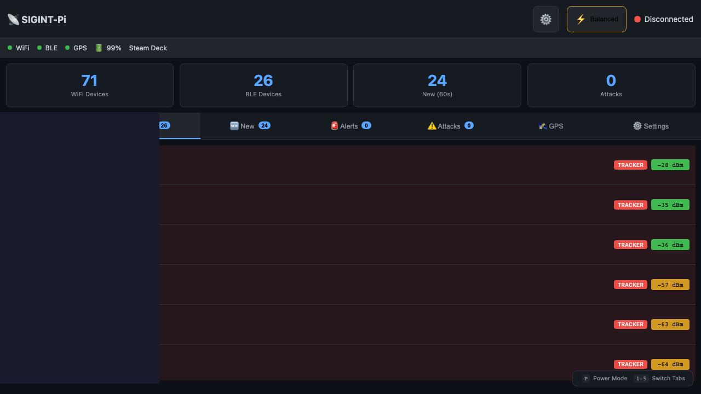

# SIGINT-Deck

Portable signals intelligence and security monitoring for Steam Deck.

## Screenshots


*WiFi monitoring with device detection, channel info, and signal strength*


*Bluetooth/BLE scanning with tracker detection (AirTag, Tile, etc.)*


*Settings panel with AI/LLM integration and quick toggles*

> **LEGAL DISCLAIMER**: This tool is for authorized security research and educational purposes only. Monitoring wireless communications without authorization may be illegal in your jurisdiction. You are solely responsible for ensuring your use complies with all applicable laws.

## Features

- **WiFi Monitoring** (802.11)
  - Device detection and tracking
  - Probe request analysis  
  - Signal strength monitoring (RSSI)
  - Attack detection (deauth, evil twin, KARMA)
  - PCAP capture for forensics

- **Bluetooth/BLE Monitoring**
  - BLE advertisement scanning
  - AirTag/Tile/SmartTag tracker detection with extended data
  - Device type classification (Phone, Wearable, SmartLight, etc.)
  - Lost mode and separated device detection

- **Tracker Intelligence**
  - Detects Find My network devices (Apple AirTags)
  - Extracts status byte, counter, key hints
  - Identifies lost mode and separated-from-owner states

- **AI/LLM Integration** (Optional)
  - Device analysis via local or cloud LLM
  - Support for llama.cpp, Ollama, LMStudio, OpenAI
  - Threat intelligence with 100+ surveillance equipment OUIs

- **GPS Integration**
  - Location tracking with USB GPS
  - Geofencing with alerts

- **Device Learning & Anomaly Detection**
  - Learns baseline of normal devices over time
  - Flags new/unknown devices immediately
  - Detects anomalous behavior patterns
  - Device fingerprinting (survives MAC randomization)
  - Configurable training period (default: 1 hour)

- **Multi-Channel Alerts**
  - Sound alerts with Ninja Mode
  - Telegram, Signal, Email, MQTT
  - Custom webhooks

## Hardware Requirements

> **IMPORTANT**: Steam Deck's internal WiFi does NOT support monitor mode!

| Component | Recommendation | Notes |
|-----------|---------------|-------|
| Steam Deck | LCD or OLED | Main platform |
| USB WiFi | Alfa AWUS036ACHM | Monitor mode required |
| USB GPS | VK-162 u-blox 7 | Optional |
| USB Hub | Powered | Recommended |

### Optional SDR Hardware

SIGINT-Deck supports Software Defined Radio for advanced spectrum monitoring:

| SDR Device | USB ID | Frequency Range | Notes |
|------------|--------|-----------------|-------|
| RTL-SDR (RTL2832U) | 0bda:2838 | 24-1766 MHz | Budget option, RX only |
| HackRF One | 1d50:6089 | 1-6000 MHz | TX/RX capable |
| LimeSDR Mini | 0403:601f | 10-3500 MHz | Full duplex, high bandwidth |
| LimeSDR USB | 1d50:6108 | 100kHz-3.8GHz | Professional grade |

### Optional IMSI Catcher Detection

| Component | Recommendation | Notes |
|-----------|---------------|-------|
| RayHunter Device | Pixel 3a/4a with RayHunter | EFF's IMSI catcher detector |
| USB Cable | Data-capable USB-C | Connect phone to Steam Deck |

## Quick Start

### 1. Enable Developer Mode

```bash
# On Steam Deck, switch to Desktop Mode
# Settings → System → Enable Developer Mode
# Open Konsole and set password:
passwd
```

### 2. Clone and Setup

```bash
git clone https://github.com/naanprofit/sigint-deck.git
cd sigint-deck

# Run setup script
chmod +x steamdeck/setup-steamdeck.sh
./steamdeck/setup-steamdeck.sh
```

### 3. Configure

```bash
cp config.toml.example ~/sigint-deck/config.toml
nano ~/sigint-deck/config.toml
```

Key settings:
- `wifi.interface` - External WiFi adapter (usually `wlan1`)
- `gps.enabled` - Enable if GPS connected
- `alerts.*` - Configure notification channels

### 4. Start

```bash
~/sigint-deck/start-sigint.sh
```

Dashboard: http://localhost:8080

## WiFi Interface Setup

The setup script ensures persistent naming:
- `wlan0` = Internal Steam Deck WiFi (managed)
- `wlan1` = External USB WiFi (monitor mode)

## Web Dashboard

Features:
- Real-time device lists (WiFi + BLE)
- **New Devices** tab - combined view of devices seen in last 60 seconds
- Tracker detection with status badges
- Attack alerts
- GPS location
- Settings management

### Keyboard Shortcuts

| Key | Action |
|-----|--------|
| 1 | WiFi tab |
| 2 | BLE tab |
| 3 | New devices |
| 4 | Alerts |
| 5 | Attacks |
| N | Toggle Ninja Mode |

## PCAP Capture

```bash
# Start capture via API
curl -X POST http://localhost:8080/api/pcap/start

# Check status
curl http://localhost:8080/api/pcap/status

# Stop capture
curl -X POST http://localhost:8080/api/pcap/stop

# List capture files
curl http://localhost:8080/api/pcap/files
```

## Geofencing

```bash
# Set home location
curl -X POST http://localhost:8080/api/geofence/home \
  -H "Content-Type: application/json" \
  -d '{"latitude": 40.7128, "longitude": -74.0060, "radius_m": 100}'

# Check status
curl http://localhost:8080/api/geofence/status
```

## Settings

Settings are saved to `~/sigint-deck/config.toml`:

```bash
# Save settings via API
curl -X POST http://localhost:8080/api/settings \
  -H "Content-Type: application/json" \
  -d @settings.json
```

## Systemd Service

```bash
# Start
systemctl --user start sigint-deck

# Stop  
systemctl --user stop sigint-deck

# Enable on boot
systemctl --user enable sigint-deck
loginctl enable-linger deck

# Logs
journalctl --user -u sigint-deck -f
```

## API Endpoints

| Endpoint | Method | Description |
|----------|--------|-------------|
| `/api/status` | GET | System status |
| `/api/wifi/devices` | GET | WiFi devices |
| `/api/ble/devices` | GET | BLE devices |
| `/api/alerts` | GET | Recent alerts |
| `/api/settings` | GET/POST | Settings |
| `/api/pcap/start` | POST | Start PCAP |
| `/api/pcap/stop` | POST | Stop PCAP |
| `/api/geofence/home` | POST | Set geofence |

## OUI Database

Includes 500+ vendor entries:
- Consumer devices (Apple, Samsung, Intel, etc.)
- IoT/Smart Home (MELK LED strips, Govee, Philips Hue, etc.)
- Threat intel (Harris/Stingray, Hikvision, Dahua, etc.)

## Device Learning

SIGINT-Deck learns your environment over time:

### Training Period
```toml
[learning]
enabled = true
training_hours = 1    # Hours to establish baseline
anomaly_threshold = 0.7
```

### What Happens
1. **During Training**: Collects device data, no anomaly alerts
2. **After Training**: Known devices become baseline, new devices flagged
3. **Location Change**: GPS detects movement > 100m, resets training

### Anomaly Detection
After training, devices are scored for unusual behavior:
- Signal strength deviation
- Unusual time of appearance  
- Behavioral pattern changes

Score > 0.7 triggers alert.

### Device Fingerprinting
Creates behavioral profiles that survive MAC randomization:
- Probe request patterns
- Time-of-day patterns
- Associated networks
- Device classification (Phone, Laptop, IoT, etc.)

## Troubleshooting

### WiFi adapter not in monitor mode
```bash
sudo ip link set wlan1 down
sudo iw wlan1 set type monitor
sudo ip link set wlan1 up
```

### GPS not detecting
```bash
# Check device
lsusb | grep -i u-blox
ls -la /dev/ttyACM*

# Start gpsd
sudo gpsd /dev/ttyACM0 -F /var/run/gpsd.sock
```

### Dashboard shows disconnected
```bash
# Check service
systemctl --user status sigint-deck

# Check API
curl http://localhost:8080/api/status
```

## SDR Support (Optional)

SIGINT-Deck supports Software Defined Radios for spectrum monitoring. Since Steam Deck has a read-only root filesystem, SDR tools are installed to `~/bin` to survive SteamOS updates.

### Install SDR Tools

```bash
# Run the SDR setup script
~/sigint-deck/scripts/install-sdr.sh
```

Or install manually:

```bash
# The script downloads and extracts SDR tools from Arch packages
mkdir -p ~/sdr-tools ~/bin/lib

# RTL-SDR
wget "https://archive.archlinux.org/packages/r/rtl-sdr/rtl-sdr-1%3A2.0.2-1-x86_64.pkg.tar.zst" -O rtl-sdr.pkg.tar.zst
zstd -d rtl-sdr.pkg.tar.zst && tar xf rtl-sdr.pkg.tar
cp usr/bin/rtl_* ~/bin/ && cp usr/lib/*.so* ~/bin/lib/

# HackRF
wget "https://archive.archlinux.org/packages/h/hackrf/hackrf-2024.02.1-3-x86_64.pkg.tar.zst" -O hackrf.pkg.tar.zst
zstd -d hackrf.pkg.tar.zst && tar xf hackrf.pkg.tar
cp usr/bin/hackrf_* ~/bin/ && cp usr/lib/*.so* ~/bin/lib/

# LimeSDR
wget "https://archive.archlinux.org/packages/l/limesuite/limesuite-23.11.0-4-x86_64.pkg.tar.zst" -O limesuite.pkg.tar.zst
zstd -d limesuite.pkg.tar.zst && tar xf limesuite.pkg.tar
cp usr/bin/Lime* ~/bin/ && cp usr/lib/*.so* ~/bin/lib/

# Add to .bashrc
echo 'export LD_LIBRARY_PATH="$HOME/bin/lib:$LD_LIBRARY_PATH"' >> ~/.bashrc
```

### SDR Tools Reference

| Tool | Purpose | Example |
|------|---------|---------|
| `rtl_sdr` | Raw I/Q capture | `rtl_sdr -f 433.92M -s 2.4M capture.bin` |
| `rtl_fm` | FM demodulation | `rtl_fm -f 99.5M -M wbfm -s 200k - \| aplay -r 48000` |
| `rtl_power` | Spectrum scanning | `rtl_power -f 400M:500M:100k -i 1 scan.csv` |
| `rtl_adsb` | Aircraft tracking | `rtl_adsb` |
| `hackrf_info` | HackRF device info | `hackrf_info` |
| `hackrf_sweep` | Wideband sweep | `hackrf_sweep -f 2400:2500 -w 100000` |
| `hackrf_transfer` | Raw TX/RX | `hackrf_transfer -r capture.bin -f 433920000` |
| `LimeUtil` | LimeSDR info | `LimeUtil --find` |
| `SoapySDRUtil` | Universal SDR API | `SoapySDRUtil --find` |

### Verify Installation

```bash
export LD_LIBRARY_PATH="$HOME/bin/lib:$LD_LIBRARY_PATH"

# Test RTL-SDR
rtl_test -t

# Test HackRF
hackrf_info

# Test LimeSDR
LimeUtil --find

# Universal check
SoapySDRUtil --find
```

## RayHunter IMSI Catcher Detection (Optional)

SIGINT-Deck integrates with EFF's RayHunter for detecting IMSI catchers (Stingrays).

### Requirements

- Pixel 3a, 3a XL, 4a, or 4a 5G with RayHunter installed
- USB data cable

### Setup

```bash
# Install ADB (Android Debug Bridge)
~/sigint-deck/scripts/install-adb.sh

# Connect phone and enable USB debugging
adb devices  # Should show your device

# Enable and start RayHunter ADB service
systemctl --user enable --now rayhunter-adb
```

### How It Works

1. RayHunter runs on the Pixel phone, monitoring cellular baseband
2. SIGINT-Deck polls RayHunter via ADB every 5 seconds
3. If IMSI catcher activity detected, a distinct siren alert plays
4. The "🐳 IMSI" tab shows real-time status

### RayHunter Analyzers

| Analyzer | Detection |
|----------|-----------|
| IMSI Identity Request | Cell tower requesting your IMSI |
| 2G Downgrade | Forced downgrade to insecure 2G |
| LTE SIB 6/7 Downgrade | Suspicious broadcast of 2G/3G priorities |

## Legal Notice

This software is for **authorized security research only**.

- Only use on networks/devices you own or have permission to monitor
- Unauthorized interception is illegal in most jurisdictions
- You are solely responsible for legal compliance

## Support

If you find SIGINT-Deck useful, consider supporting development:

**Bitcoin:** `3GD3hpufcCPCemfQdoAFu9JH5Td5US1pzJ`

## License

MIT License

## Repository

https://github.com/naanprofit/sigint-deck
